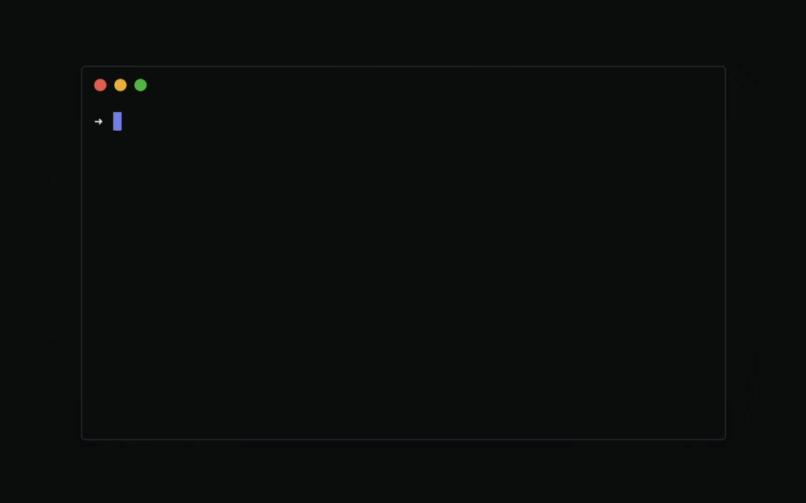

<p align="center">
	<h1 align="center">
		
		<br>
		github-pewpew
	</h1>
	<p align="center">Pew pew needless GitHub repos!<br>Clean up your unused repos via the CLI within seconds.</p>
	<p align="center">
		<a href="https://badge.fury.io/js/github-pewpew"></a>
		<a href="https://justforfunnoreally.dev/"></a>
	</p>
</p>

<p align="center">
	<br>
	
	<br>
</p>

## Installation and Usage

To install the latest version of github-pewpew CLI, run this command:

```
npm i -g github-pewpew
```

To quickly start using it, run the following command:

```
ghpew
```

Available commands:

```
ghpew repos
ghpew codespaces
ghpew help
```

## Why?

Have you ever had too much fun with the GitHub API and ended up creating too many dummy repos? Me too 😅!

I made this little CLI tool to clean up repositories quickly. I'm planning to add some flags and regexp to delete in bulk in the future. [Let me know](http://twitter.com/adrianmg) if that sounds interesting to you.

Do you want to know more? [Visit the official website](https://adrianmato.com/pewpew).

## Development

The important parts of the project are the following:

```
├── .github                GitHub Actions workflows and repo settings
├── src
│   ├── commands
│   │   ├── codespaces.js  Contains the command to delete codespaces
│   │   └── repos.js       Contains the command to delete repos
│   ├── config.js          Contains the configuration manager
│   ├── github.js          Business logic: authentication and API calls
│   ├── ui.js              CLI interactions
│   └── utils.js           Lightweight utility functions
├── test
│   └── test.js            Test coverage with Mocha
├── .prettierrc            Code formatting configuration
├── index.js               The main thread of execution
├── README.md              you're looking at it
```

To **set up your environment** to develop this tool, run:

- `npm install`
- `node index`

You can also run `node index DEV=true CLIENT_ID=<YOUR_TESTING_CLIENT_ID>` if you want to use your own client id for development and testing purposes.

All the tests are written with [mocha](https://mochajs.org/) and can be run with `npm test`.

## TODO

- TODO: `--force` flag to avoid confirmation
- TODO: `--regex` flag to delete repos matching a regex
- TODO: `--list` flag to delete repos from a comma-separated list
- TODO: `--archive` and `-a` flag to [archive repositories](https://github.com/adrianmg/github-pewpew/issues/34) instead of deleting
- TODO: `ghpew gists` command to [delete gists](https://github.com/adrianmg/github-pewpew/issues/36)

## Questions? Ideas? Bugs?

If you run into any issues or you'd like to share your thoughts, feel free to [open an issue](https://github.com/adrianmg/github-pewpew/issues) in this repository or hit me up on [Twitter](https://twitter.com/adrianmg).

## Contributions

Logo designed by [Rapha Lopes](https://twitter.com/raphaellopesph). Thanks to [@sergiou87](https://github.com/sergiou87), [@zschiller](https://github.com/zschiller), [@mamuso](https://github.com/mamuso), [@anishde12020](https://github.com/anishde12020), and [@jdvr](https://github.com/jdvr) for contributing with their feedback and ideas 🙇‍♂️.

## License

The tool is available as open-source under the terms of the [MIT License](http://opensource.org/licenses/MIT).
